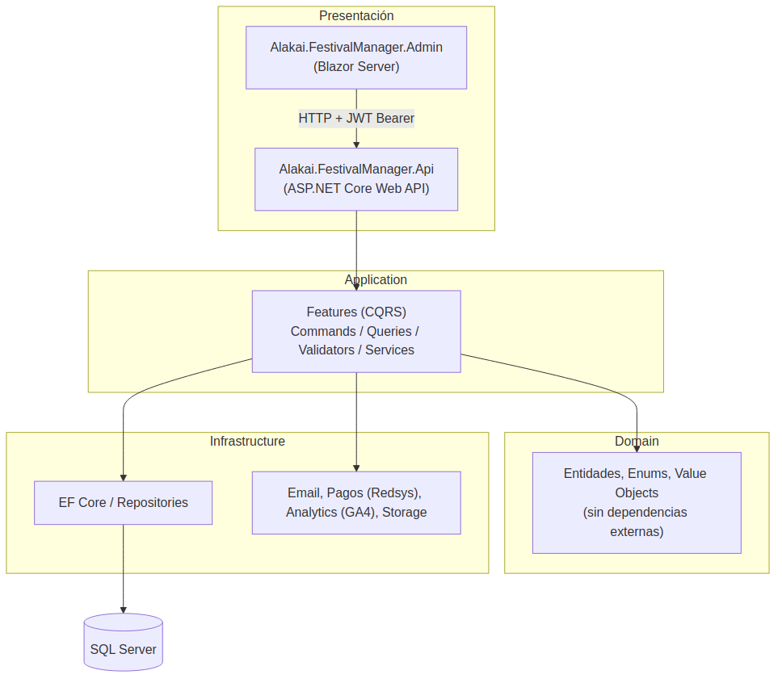
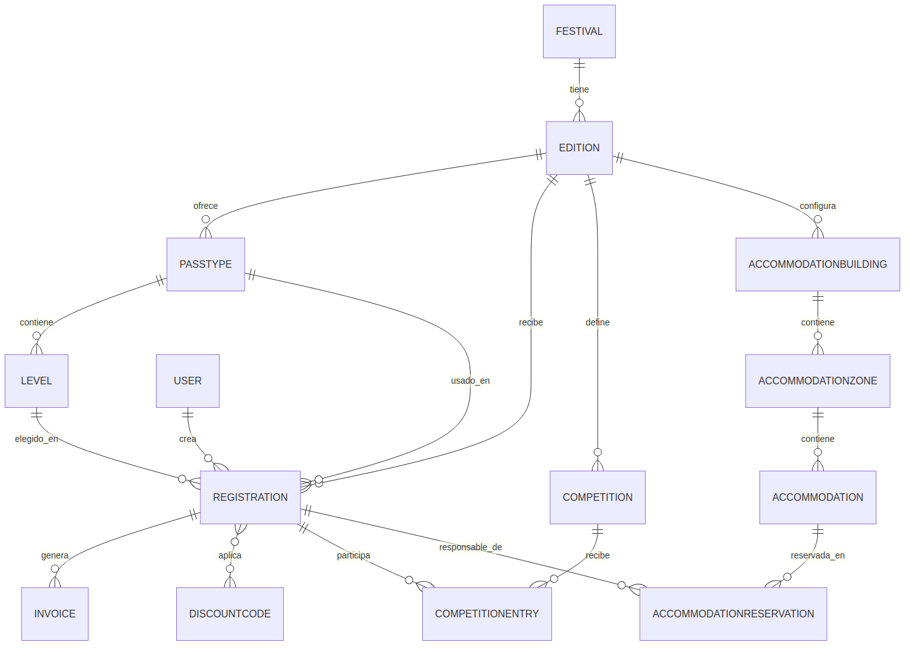
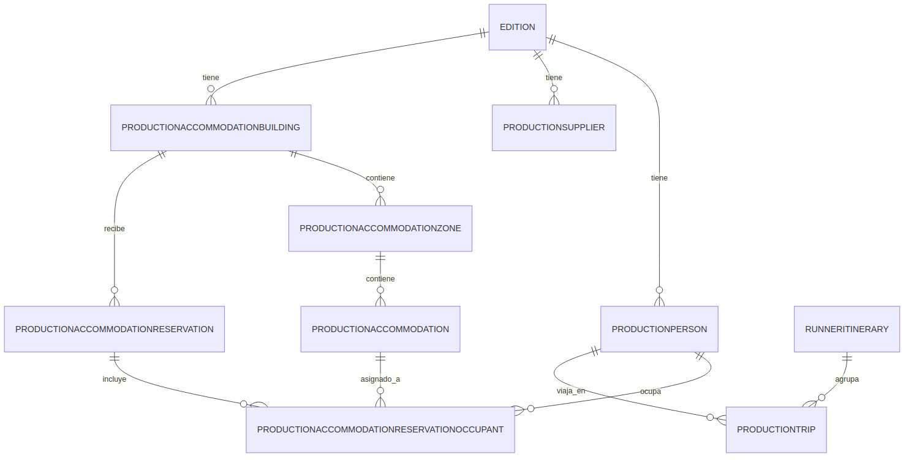

# Alakai FestivalManager — Documentación Técnica

**Versión:** 1.0
**Fecha:** Julio 2026
**Autor:** Alakai Systems

---

## Índice

1. [Resumen ejecutivo](#1-resumen-ejecutivo)
2. [Arquitectura del sistema](#2-arquitectura-del-sistema)
3. [Stack tecnológico](#3-stack-tecnológico)
4. [Modelo de dominio](#4-modelo-de-dominio)
5. [Capa Application (CQRS)](#5-capa-application-cqrs)
6. [Capa Infrastructure](#6-capa-infrastructure)
7. [Capa Api](#7-capa-api)
8. [Capa Admin (Blazor Server)](#8-capa-admin-blazor-server)
9. [Seguridad y autorización](#9-seguridad-y-autorización)
10. [Módulos funcionales](#10-módulos-funcionales)
11. [Módulo de Producción](#11-módulo-de-producción)
12. [Testing](#12-testing)
13. [Despliegue e infraestructura](#13-despliegue-e-infraestructura)
14. [Lecciones operativas y deuda técnica](#14-lecciones-operativas-y-deuda-técnica)

---

## 1. Resumen ejecutivo

Alakai FestivalManager es una plataforma SaaS multi-tenant para la gestión integral de festivales de baile y música. Un mismo despliegue de Api sirve a múltiples festivales (clientes), cada uno con su propio dominio de marca, mientras que el Admin puede desplegarse por cliente o compartirse.

La plataforma resuelve tres necesidades distintas con tres superficies separadas:

- **Panel de Administración** — gestión completa del festival por el equipo organizador.
- **Formulario de Inscripción público + Panel de Usuario** — lo que usan los participantes, sin necesidad de cuenta de administrador.
- **Módulo de Producción** — un área restringida dentro del propio Admin, pensada para el equipo que gestiona artistas, proveedores, alojamiento técnico y logística de viajes, independiente del flujo de inscripciones.

El sistema sigue **Clean Architecture** con separación estricta en cuatro proyectos (Domain, Application, Infrastructure, y las dos superficies de presentación Api/Admin), más un quinto proyecto de tests.



---

## 2. Arquitectura del sistema

### 2.1 Principio general

El sistema sigue el patrón de **Clean Architecture / Onion Architecture**: las dependencias siempre apuntan hacia el centro (Domain), nunca al revés.

| Capa | Proyecto | Depende de | Responsabilidad |
|---|---|---|---|
| Dominio | `Alakai.FestivalManager.Domain` | Nada | Entidades, enums, reglas de negocio puras |
| Aplicación | `Alakai.FestivalManager.Application` | Domain | Casos de uso (CQRS), validadores, interfaces de repositorio y servicios externos |
| Infraestructura | `Alakai.FestivalManager.Infrastructure` | Application, Domain | EF Core, repositorios concretos, integraciones externas (email, pagos, analytics) |
| Presentación (Api) | `Alakai.FestivalManager.Api` | Application, Infrastructure | Controllers REST, autenticación JWT |
| Presentación (Admin) | `Alakai.FestivalManager.Admin` | — (consume la Api por HTTP) | Blazor Server, UI del equipo organizador y de Producción |
| Tests | `Alakai.FestivalManager.Tests` | Application, Domain | Tests unitarios y de integración |

Un detalle importante de este proyecto: **el Admin no referencia Application/Infrastructure directamente** — es un cliente HTTP más, que habla con la Api exactamente igual que lo haría cualquier integración externa. Esto significa que toda regla de autorización debe aplicarse **en la Api**, nunca asumirse resuelta por el hecho de que la petición venga del propio Admin.

### 2.2 Patrón CQRS en Application

Cada funcionalidad de escritura se modela como un **Command** con su **Handler** y su **Validator** (FluentValidation) en carpetas separadas; las lecturas usan **Services** que devuelven DTOs directamente, sin pasar por el patrón Command/Handler completo salvo cuando la consulta tiene lógica de negocio relevante.

Estructura típica de una feature (ejemplo: `ProductionReservations`):

```
Features/ProductionReservations/
├── Commands/
│   ├── CreateReservation/
│   │   ├── CreateReservationCommand.cs
│   │   ├── CreateReservationHandler.cs
│   │   └── CreateReservationCommandValidator.cs
│   └── UpdateReservation/
│       └── ...
├── Contracts/
│   ├── DTOs/
│   └── Requests/
└── Services/
    └── ProductionReservationService.cs
```

---

## 3. Stack tecnológico

| Categoría | Tecnología |
|---|---|
| Backend | .NET 9, ASP.NET Core Web API |
| Frontend Admin | Blazor Server (.NET 9), TailwindCSS, Alpine.js |
| Base de datos | SQL Server, Entity Framework Core (Code-First, migraciones) |
| Autenticación Api | JWT Bearer (access + refresh token) |
| Autenticación Admin | Cookie Authentication (ASP.NET Core Identity cookie, no Identity framework completo) |
| Validación | FluentValidation |
| Mapeo objeto-objeto | AutoMapper |
| Generación de Excel | ClosedXML |
| Pagos | Redsys (TPV Virtual) |
| Email | SMTP configurable por festival |
| Analítica | Google Analytics 4 (Data API) |
| Testing | xUnit (o equivalente), tests unitarios de validadores/handlers e integración de Api |
| Hosting | Azure App Service (Api y Admin como servicios independientes) |

---

## 4. Modelo de dominio

El proyecto Domain contiene **41 entidades** y **20 enums**, todas como POCOs sin dependencias externas (ni de EF Core, ni de ASP.NET). Las relaciones se configuran en Infrastructure vía Fluent API, no con atributos en el propio Domain.

### 4.1 Núcleo del sistema



- **Festival** → **Edition** (una convocatoria concreta, por ejemplo "La Jam Barcelona 2027") → **PassType** → **Level**.
- **Registration** es la entidad central de una inscripción: referencia a `User`, `Edition`, `PassType`, `Level` opcional, y lleva sus propios datos personales duplicados (no solo una referencia a `User`) para conservar el dato tal como era en el momento de la inscripción.
- **DiscountCode** se aplica a `Registration` por valor de código (no hay entidad "Grupo" separada — el propio código de descuento hace de agrupador).
- **Invoice** se genera a petición del propio participante desde su Panel de Usuario, nunca automáticamente.

### 4.2 Enumeraciones clave

| Enum | Valores | Uso |
|---|---|---|
| `UserRole` | SuperAdmin=1, Admin=2, User=3, Production=4 | Rol embebido en el JWT y usado por `[Authorize(Roles=...)]` en toda la Api |
| `FestivalModule` | `[Flags]` None=0, Competitions=1, Accommodation=2, Transport=4, Meals=8 | Módulos opcionales activables por festival |
| `PaymentPlan` | FullOnline=1, SplitFiftyFifty=2, DeferredTenDays=3 | Los tres planes de pago disponibles en el formulario público |
| `RegistrationStatus` / `PaymentStatus` | — | Estado de la inscripción y del pago, independientes entre sí |
| `DocumentType` | Dni=1, Passport=2 | Compartido entre participantes y Producción |

> **Nota:** `UserRole` es el enum que de verdad usa el backend para JWT y autorización. Existe un enum análogo `AdminUserRole` en el proyecto Admin, usado solo para lógica de UI (qué menú mostrar) — son dos enums independientes que deben mantenerse sincronizados manualmente; un fallo real de esta sesión fue añadir `Production` a uno y olvidar el otro.

---

## 5. Capa Application (CQRS)

`Features/` contiene 32 subcarpetas, una por área funcional. Cada Command sigue el mismo esqueleto:

```csharp
public class CreateXCommand
{
    // propiedades de entrada
}

public class CreateXCommandValidator : AbstractValidator<CreateXCommand>
{
    public CreateXCommandValidator()
    {
        RuleFor(x => x.Campo).NotEmpty();
        // ...
    }
}

public class CreateXHandler
{
    public async Task<XDto> HandleAsync(CreateXCommand command, CancellationToken ct)
    {
        // construye la entidad de Domain, la persiste via repositorio, mapea a Dto
    }
}
```

Los `Services` (p. ej. `IReportService`, `IDashboardService`) se usan cuando la operación es de solo lectura y no necesita el ritual completo de Command/Validator — la mayoría de generación de informes y estadísticas vive aquí.

### 5.1 Reportes (`IReportService` / `ReportService`)

Genera archivos `.xlsx` directamente con ClosedXML, sin plantillas externas. Dos estilos de informe conviven en el mismo servicio:

- **Tabla plana** (`BuildXlsx(sheetName, headers, rows)`): usado por la mayoría de listados (Users, Registrations, Artists & Team, Suppliers, Trips…).
- **Informe seccionado**: construido celda a celda con ClosedXML directamente (sin el helper `BuildXlsx`), usado por los informes visuales — el plano de habitaciones (Accommodation Floor Plan) y el informe de Runner Itineraries agrupado por itinerario.

---

## 6. Capa Infrastructure

### 6.1 Persistencia

- **EF Core Code-First**, con 41 migraciones aplicadas hasta la fecha de este documento.
- Un `DbContext` único (`FestivalManagerDbContext`) para todo el sistema.
- Las relaciones y comportamiento de borrado en cascada se configuran explícitamente por entidad en `Configurations/` (Fluent API) — la convención general del proyecto es `Restrict` salvo en jerarquías de contención directa (p. ej. `Building → Zone → Accommodation → Occupants`, donde sí se permite `Cascade`).

### 6.2 Repositorios

Un repositorio por entidad raíz de agregado, siguiendo el patrón `IXRepository` (interfaz en Application) / `XRepository` (implementación en Infrastructure). No hay un patrón `IUnitOfWork` genérico separado — el propio `DbContext` inyectado hace de unidad de trabajo.

### 6.3 Integraciones externas

| Integración | Carpeta | Notas |
|---|---|---|
| Autenticación / JWT | `Auth/` | `JwtService`: genera access token (15-60 min) y refresh token (7-30 días), ambos firmados con `HmacSha256` |
| Pagos | `Payments/` | Integración con Redsys (TPV Virtual): creación de sesión de pago y verificación de notificaciones/retornos |
| Email | `Email/` | Envío SMTP configurable por festival (host, puerto, usuario, contraseña, remitente, SSL) |
| Analítica | `Analytics/` | Lectura de Google Analytics 4 vía su Data API, por Property ID configurado por festival |
| Tareas en segundo plano | `BackgroundTasks/` | Tareas programadas (p. ej. limpieza de tokens caducados) |

---

## 7. Capa Api

### 7.1 Controllers

**41 controllers** en total. Todos siguen el patrón fino: reciben Request/Command, delegan en un `Service` o `Handler` de Application, devuelven `ApiResponse<T>` con forma consistente `{ success, message, data, errors }`.

### 7.2 Esquema de autorización por controller

| Grupo | Roles permitidos | Controllers |
|---|---|---|
| Público (sin `[Authorize]`) | — | `PublicFestivalsController`, `PublicRegistrationsController`, `PaymentsController` (llamado por el propio banco/participante anónimo) |
| Gestión general | `SuperAdmin, Admin` | Registrations, Competitions/Entries, Buses/Reservations, Accommodations/Zones/Buildings/Reservations (participantes), MealPreferences, DiscountCodes, PassType, Level, Invoices/Settings/Templates, Emails/Templates/Layout/Logs, Analytics, Dashboard, Uploads, Users (mayoría de acciones) |
| Compartido con Producción | `SuperAdmin, Admin, Production` | Editions, Festivals, Reports, y los 8 controllers propios de Producción |
| Autoservicio (autenticado + comprobación de propiedad) | Cualquier rol autenticado, con verificación interna | `UsersController.GetById` / `.Update` — cualquier usuario puede ver/editar **su propio** perfil; `SuperAdmin`/`Admin` pueden ver/editar cualquiera |
| Ya existente, sin tocar | Roles propios | `AdminImpersonationController` (SuperAdmin), `AuthController`, `UserPanelController` |

> **Nota de arquitectura importante:** en ASP.NET Core, `[Authorize(Roles="X")]` a nivel de **clase** y `[Authorize]` a nivel de **método** no se anulan entre sí — se combinan (ambas condiciones deben cumplirse). Para dar acceso de autoservicio a una acción concreta dentro de un controller restringido por rol, la única forma correcta es **no** poner restricción de rol en la clase y aplicar `[Authorize(Roles=...)]` explícitamente en cada acción que sí lo necesite, dejando la acción de autoservicio con `[Authorize]` a secas + una comprobación de propiedad en el propio código (`IsSelfOrAdmin`). Usar `[AllowAnonymous]` en una acción sí anula toda restricción heredada — es el mecanismo correcto para el único endpoint verdaderamente público dentro de un controller por lo demás restringido (`RegistrationsController.Create`, usado por el formulario público).

### 7.3 Formato de respuesta estándar

```json
{
  "success": true,
  "message": null,
  "data": { "...": "..." },
  "errors": []
}
```

---

## 8. Capa Admin (Blazor Server)

### 8.1 Estructura

**47 páginas Razor** bajo `Components/Pages/`, organizadas por el menú lateral (`Sidebar.razor`) en bloques: Event Setup, Operations, Communication, Settings, y Producción (visible solo si el rol lo permite).

### 8.2 Autenticación

- Cookie de sesión (`CookieAuthenticationDefaults.AuthenticationScheme`), independiente del JWT de la Api.
- La cookie lleva embebido el `access_token`/`refresh_token` de la Api como claims adicionales (no solo la identidad del usuario) — así el Admin puede reenviarlos en cada llamada saliente sin volver a autenticar.
- `AdminTokenProvider` (`IAdminTokenProvider`) centraliza la lógica de "dame un access token válido, refrescando si hace falta" para que cada `ApiClient` la reutilice.

### 8.3 Patrón de ApiClient

Cada `XApiClient` (uno por controller de la Api, en `Services/Api/`) sigue el mismo esqueleto:

```csharp
public class XApiClient
{
    private readonly HttpClient _httpClient;
    private readonly IAdminTokenProvider _adminTokenProvider;

    private async Task AttachAuthHeaderAsync()
    {
        string? token = await _adminTokenProvider.GetValidAccessTokenAsync();
        if (!string.IsNullOrWhiteSpace(token))
        {
            _httpClient.DefaultRequestHeaders.Authorization = new AuthenticationHeaderValue("Bearer", token);
        }
    }

    public async Task<T> GetXAsync(...)
    {
        await AttachAuthHeaderAsync();
        // llamada HTTP + deserializacion de ApiResponse<T>
    }
}
```

> **Lección operativa:** este adjuntado del token se hace **dentro de cada ApiClient**, no mediante un `DelegatingHandler` centralizado. Se intentó centralizarlo una vez y falló en producción con el error *"Do not call GetAuthenticationStateAsync outside of the DI scope"* — en Blazor Server, un handler enganchado vía `.AddHttpMessageHandler<T>()` no se resuelve dentro del scope del circuito del usuario, y `AuthenticationStateProvider` exige exactamente ese scope. El patrón correcto y ya probado es el de arriba, repetido en cada cliente.

### 8.4 Restricción de rutas para el rol Production

`MainLayout.razor` implementa un guardia activo: en cada navegación, si el usuario tiene rol `Production` y la ruta no empieza por `production`, `profile` o `dashboard`, se le redirige a `/production-team`. Esto se ejecuta tanto en el primer render como en cada `NavigationManager.LocationChanged`.

---

## 9. Seguridad y autorización

### 9.1 Doble identidad: cookie del Admin vs. JWT de la Api

Es importante entender que **hay dos "sesiones" distintas conviviendo**:

1. La **cookie del Admin** (Blazor Server), que determina qué ve la interfaz (`AuthenticationStateTask`, `User.IsInRole(...)` en los componentes Razor).
2. El **JWT de la Api**, embebido como claim dentro de esa misma cookie, que es lo que de verdad autoriza cada llamada HTTP a la Api.

Ambos se generan en el mismo momento (login) con el mismo `ClaimTypes.NameIdentifier` y el mismo rol, por lo que están sincronizados en la práctica — pero conceptualmente son dos superficies de autorización independientes, y cualquier cambio de rol de un usuario exige que ese usuario vuelva a iniciar sesión para que la nueva sesión (cookie + JWT) refleje el cambio.

### 9.2 Roles

| Rol | Alcance |
|---|---|
| `SuperAdmin` | Acceso total, incluida la gestión de usuarios del Admin (Settings) |
| `Admin` | Acceso total salvo Settings (gestión de usuarios) |
| `Production` | Solo el módulo de Producción, más `/profile` y `/dashboard` (compartido) |
| `User` | Participantes — no usa el Admin, usa el Panel de Usuario y su propio JWT de alcance más limitado |

### 9.3 Migraciones de seguridad recientes

La auditoría completa de `[Authorize]` (pasar de ~10 de 41 controllers protegidos a los 41) reveló dos clases de fallos no evidentes hasta probarlos en producción real:

1. **ApiClients sin token**: controllers recién protegidos cuyos `ApiClient` correspondientes nunca habían necesitado adjuntar un token (porque el controller estaba abierto) empezaron a fallar con 401 para cualquier usuario, no por un problema de roles.
2. **Combinación de `[Authorize]`**: como se explica en la sección 7.2, un `[Authorize]` de método no anula un `[Authorize(Roles=...)]` de clase.

---

## 10. Módulos funcionales

### 10.1 Configuración del festival

`Festival` → `Edition` → `PassType` → `Level`. Cada edición es independiente en fechas, tipos de pase, niveles e inscripciones. Un festival puede tener dominio propio (`CustomDomain`), credenciales de pago/email propias (`FestivalCredentials`), y módulos opcionales activables (`FestivalModule`, flags).

### 10.2 Inscripciones

El formulario público (7 pasos: Pase → Nivel(es) → Rol → Pareja → Datos personales → Términos → Plan de pago) crea un `Registration`. El pago se resuelve vía Redsys en tres modalidades (completo, 50/50, diferido a 10 días), cada una con su propia comisión de gestión.

### 10.3 Competiciones

`Competition` (Individual / Partnered / Team) con `CompetitionLevel` opcionales y capacidad controlada por nivel y rol. Los participantes se inscriben desde su propio Panel de Usuario.

### 10.4 Alojamiento (participantes)

Estructura de tres niveles `AccommodationBuilding → AccommodationZone → Accommodation`, con reserva por parte del propio participante (hasta 12 ocupantes por reserva) y gestión operativa (asignación a unidad concreta) desde el Admin.

### 10.5 Autobuses y Comidas

Los dos módulos más sencillos: rutas con capacidad y precio propio (Buses); preferencia alimentaria única por festival, sin capacidad que gestionar (Meals).

### 10.6 Comunicación

16 tipos de email automático (`EmailTemplateKey`), con plantilla por edición o global, en el idioma del participante (con inglés como respaldo). `EmailLayout` define cabecera/pie comunes; `EmailLogs` registra cada envío con su estado (Pending/Sent/Failed).

### 10.7 Facturación

`Invoice` se genera solo a petición del participante desde su Panel de Usuario, usando los datos fiscales configurados por el organizador en `InvoiceTemplates` (que pueden variar por edición).

---

## 11. Módulo de Producción

Añadido en esta fase del proyecto (migraciones `AddProductionModule`, `AddProductionPersonManagerEmail`, `AddProductionReservationRoomType`). Es un área independiente del resto del Admin — gestiona artistas, equipo técnico, proveedores, alojamiento técnico y logística de viajes; no depende de ningún flag de módulo, está siempre disponible.



### 11.1 Entidades

| Entidad | Descripción |
|---|---|
| `ProductionPerson` | Artista o miembro de equipo. Categoría (Artist/Team), rol libre, contacto (incluido email de manager opcional), documento y nacionalidad |
| `ProductionSupplier` | Proveedor del festival, con notas libres para múltiples contactos |
| `ProductionAccommodationBuilding` → `Zone` → `Accommodation` | Misma jerarquía de tres niveles que el alojamiento de participantes, pero en un espacio completamente separado |
| `ProductionAccommodationReservation` + `...Occupant` | A diferencia del alojamiento de participantes, aquí no hay autoservicio — el propio equipo organizador crea la reserva y asigna zona/unidad. Incluye `RoomType` (int simple, sin enum en Domain — el significado de 1/2/3 como DUI/Twin/Matrimonio vive solo en el Admin) |
| `ProductionTrip` | Viaje individual (vuelo/tren) de una persona |
| `RunnerItinerary` | Agrupa varios `ProductionTrip`; se numera automáticamente por orden cronológico en la UI (no es un campo persistido — se calcula al vuelo ordenando por fecha) |

### 11.2 Rol de acceso `Production`

Un cuarto rol (`UserRole.Production = 4`) que solo ve el módulo de Producción, `/profile` y `/dashboard` compartido. Ver sección 9 para el detalle de por qué este rol tocó tres capas distintas (Domain, validadores de creación de usuario, y guardia de rutas del Admin) para funcionar de verdad.

### 11.3 Informes

Reutiliza la misma infraestructura de `ReportService` que el resto del sistema: Artists & Team, Suppliers, Trips y Accommodation como tablas planas; Accommodation (Floor Plan) y Runner Itineraries como informes seccionados con ClosedXML directo.

---

## 12. Testing

**17 archivos de test**, divididos en:

- `Unit/Application/` — validadores (`CreateXCommandValidatorTests`) y handlers (`CreateRegistrationHandlerTests`, `UpdateRegistrationHandlerTests`, `DeleteRegistrationHandlerTests`, `CreateCompetitionEntryHandlerTests`), más servicios de dominio puros (`DiscountCalculationServiceTests`, `EmailTemplateRendererServiceTests`, `PaymentServiceTests`, `JwtServiceTests`, `AuthServiceLoginTests`, `LoginCommandValidatorTests`).
- `Integration/Api/` — tests de integración contra la Api real.
- `Builders.cs` — object mothers/builders compartidos para construir entidades de prueba de forma consistente.

La cobertura actual se concentra en Registrations, Competitions y Auth — el módulo de Producción, al ser el más reciente, todavía no tiene tests dedicados (ver sección 14).

---

## 13. Despliegue e infraestructura

- **Azure App Service**, un servicio para la Api y otro para el Admin, por cliente/festival cuando aplica (ejemplo real: `app-alakai-swimout-api-....azurewebsites.net`).
- Cada festival puede además tener su propio dominio de marca apuntado por DNS (`app.tudominio.com`), resuelto en runtime vía `PublicFestivalsController` (`by-domain`).
- Variables de entorno / configuración por entorno para: cadena de conexión SQL, `JwtSettings` (clave secreta, issuer, audience, expiración), credenciales de Redsys y SMTP (estas dos también configurables por festival desde el propio Admin, no solo por entorno).
- Los logs de la Api en producción son la fuente más fiable para diagnosticar problemas de autorización — el propio Azure Portal (`Monitoring → Log stream`) permite ver en tiempo real cada petición saliente del Admin y su código de respuesta, sin necesitar acceso a la consola del navegador (que en Blazor Server no muestra las llamadas internas servidor-a-servidor).

---

## 14. Lecciones operativas y deuda técnica

Recogidas de la implementación real de esta fase, para no repetirlas:

1. **Un enum "de verdad" vive en Domain; cualquier enum paralelo en Admin es solo para UI.** Añadir un valor a uno sin añadirlo al otro produce fallos silenciosos y difíciles de rastrear (el caso de `Production` en `AdminUserRole` sin el correspondiente en `Domain.UserRole`).
2. **`[Authorize]` de método no anula `[Authorize(Roles=...)]` de clase.** Se combinan. Para un endpoint de autoservicio dentro de un controller restringido, la restricción de rol debe moverse a cada acción individual, no dejarse a nivel de clase.
3. **Un `DelegatingHandler` centralizado para adjuntar tokens no funciona en Blazor Server** — rompe con un error de scope de DI. El patrón correcto es adjuntar el token dentro de cada `ApiClient`.
4. **Cualquier columna nueva en una entidad de Domain exige una migración EF Core real** (`Add-Migration` + `Update-Database`) antes de desplegar — no basta con considerarlo "solo un cambio de Admin" si el dato debe sobrevivir para aparecer en informes.
5. **Pendiente**: tests dedicados para el módulo de Producción; limpieza de las referencias a "Responsible" en los informes de alojamiento de Producción (el campo ya no se usa en el flujo de reservas, pero los informes todavía muestran la columna/resaltado, ahora siempre vacío).

---

*Documento generado a partir de la inspección directa del código fuente del proyecto (Domain, Application, Infrastructure, Api, Admin, Tests) en su estado de julio de 2026.*
